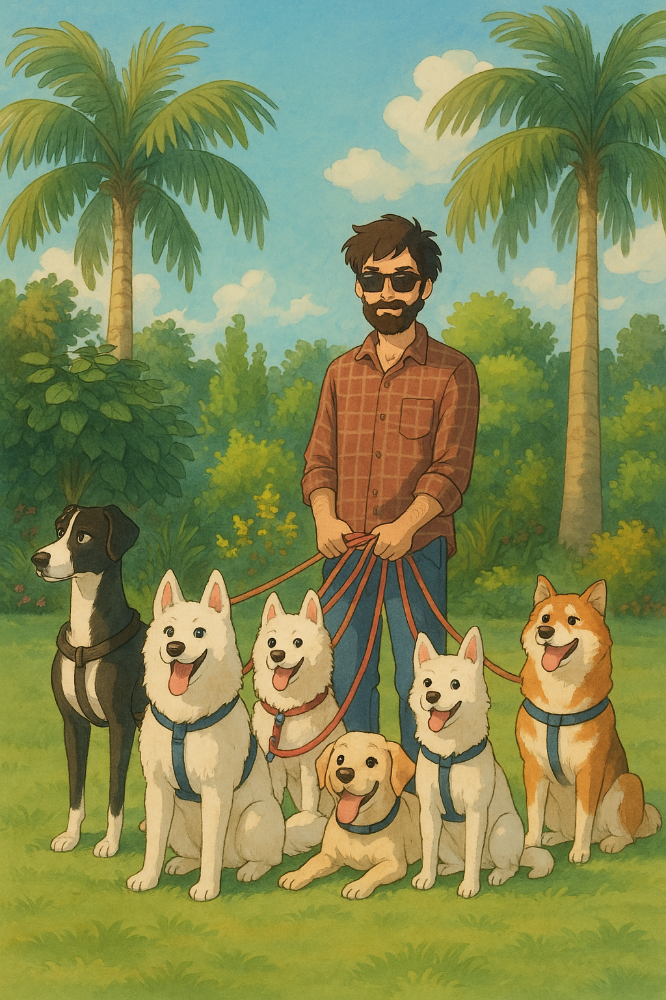

---

tags:
  - Technical Writer

---

# About me

Hi, I'm **Harsh Kanth**, a **senior technical writer**, **content designer**, **documentation architect**, and **documentation specialist** with **10 years of experience** building world-class content systems for companies across domains like **SaaS**, **AI**, **fintech**, **e-commerce**, **insurtech**, **cloud**, and **retail tech**.

I create documentation and content that bridges complexity and clarity—enabling users to self-serve, developers to integrate, and products to grow faster.

That’s me:

{width=300px}

## What i do

I work across the full content lifecycle from zero-to-one documentation builds to optimizing legacy systems.  
My core specialties include:

- **🛠 Technical writing**  
  End-user documentation, internal wikis, process flows, SDK manuals, CI/CD system guides, and training content (Camtasia)

- **🧑‍💻 API and developer documentation**  
  Integration content, Postman collections, JSON/YAML schema documentation, REST/Graph API references, and platform onboarding

- **🧠 Content strategy and architecture**  
  Documentation site structure planning, taxonomy design, Git-based workflows, and content governance across teams

- **✍️ UX writing and microcopy**  
  In-app instructions, modal content, error messages, tooltips, and onboarding flows—written with empathy and product logic

- **📢 Content writing and SEO**  
  Web copy, product descriptions, blogs, whitepapers, case studies, and ghostwritten content for global clients

## Experience that matters

Over the last decade, I have:

- Worked with global brands like **Microsoft**, **Amazon**, **BMW USA**, and **Western Union** (direct and ghostwriting)  
- Led documentation teams at **OneShield**, **Vision Group**, and **Fusioni Technologies**  
- Delivered content for **AI**, **AR/VR**, **SDKs**, **SaaS products**,** automation platforms**, and brick-and-mortar retail technologies  
- Migrated static documentation into GitHub-based systems using **MkDocs**, **CI/CD pipelines**, and **Markdown workflows**  
- Worked remotely with teams across the United States, Europe, and the Asia-Pacific region  
- Created scalable documentation systems aligned with business goals, engineering workflows, and user journeys

## 🛠️ Tools, platforms, and languages

Over 10 years, I have worked extensively with modern documentation tools, authoring platforms, and technologies—enabling me to build, migrate, and scale content systems efficiently.

### 📝 Authoring and documentation tools

- Markdown, AsciiDoc, reStructuredText  
- GitHub Pages, MkDocs, Sphinx  
- Adobe RoboHelp, Adobe FrameMaker, MadCap Flare  
- Camtasia (for training modules)  
- Oxygen XML Editor

### 🛠 Platforms and CMS

- Confluence, SharePoint, Notion  
- Azure DevOps, learning management systems (LMS)  
- WordPress CMS, Google Docs  
- GitHub, GitLab, Bitbucket

### 🔧 Workflow and development tools

- Git, Jira, Slack, Trello, Figma  
- Postman (API testing), Swagger/OpenAPI  
- Acrolinx (style and grammar checker)  
- Visual Studio, Visual Studio Code  
- Microsoft Office Suite (Excel, Word, PowerPoint)  
- Microsoft Azure Cloud and Azure Active Directory  
- Ngrok, IoT tools

### 🛡️ Technical and backend technologies

- SQL queries and database documentation  
- HTML, CSS  
- XML and JSON metadata documentation  
- CI/CD pipeline tools: Jenkins, Bamboo, JFrog, Nexus

### 💻 Programming languages

- C++  
- C#  
- Basic Java and JavaScript  
- Python
- Node.js
- MATLAB
- Makrdown
- HTML
- CSS

### 🌐 Domains I have worked in

- SaaS and platform services  
- Insurtech, fintech, and e-commerce  
- AI, ML, image recognition, and autonomous retail  
- Automotive UX  
- Cloud infrastructure  
- Edtech and consumer applications

## My approach

Every document, guide, or help article I create follows four key principles:

- **Clarity:** Language that’s accessible and user-centered  
- **Structure:** Organized with reusability and scalability in mind  
- **Empathy:** Designed to solve real user and developer pain points  
- **Maintainability:** Easy to evolve as the product grows

Whether I am building from scratch or auditing legacy documentation, I focus on writing that works for your users, your product, and your business.

## Let's connect

Looking to build better documentation? Need a system that scales? Or want someone who can plug into your team and **own the documentation** from strategy to delivery?

📫 Let’s talk—  
[Chat with me on WhatsApp](https://wa.me/917827620848)  
Or visit the [Contact](contact.md) page to connect.
