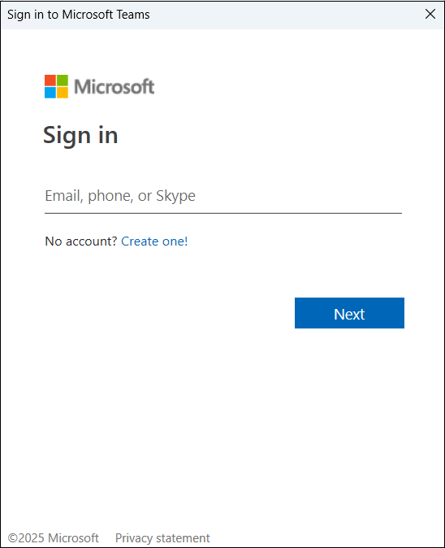
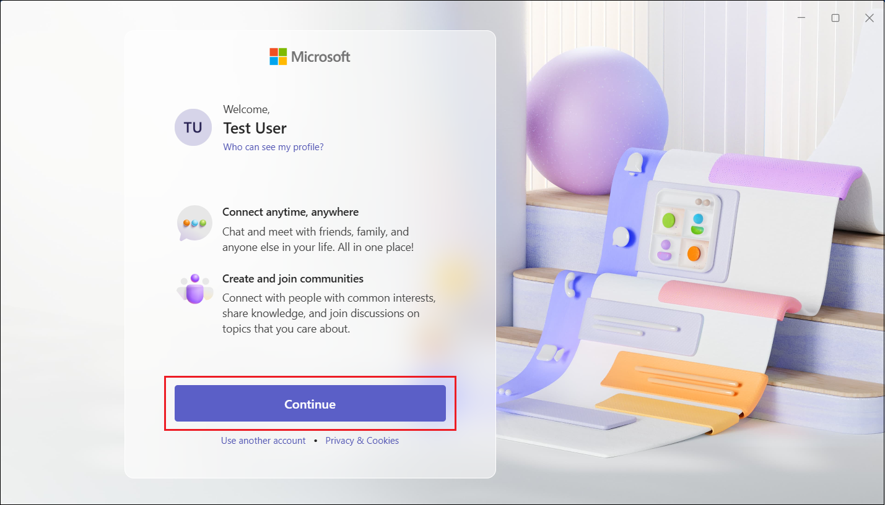

# How to schedule a meeting in Microsoft Teams

Scheduling a meeting in Microsoft Teams is an effective way to collaborate with your team, clients, or colleagues remotely. Whether it's a one-on-one meeting, a team meeting, or a large event, Teams offers a flexible way to manage all your meetings in one place. This guide will take you through the steps to schedule a meeting in Microsoft Teams.

## Audience
This guide is for users who needs help scheduling meetings in Microsoft Teams. It is ideal for individuals or teams looking to plan, organize, and manage virtual meetings.

---

## Why use Microsoft Teams for meetings?

Microsoft Teams is a unified communication and collaboration platform that enables you to set up meetings with colleagues, share files, and work together in real-time. By scheduling a meeting in Teams, you can:

- Seamlessly collaborate with remote colleagues
- Keep track of your meeting schedule in one place
- Add important details such as meeting agendas and links
- Easily integrate with Outlook and other Microsoft 365 tools

---

## Schedule a meeting in Microsoft Teams
To schedule a meeting in Microsoft teams, perform the following steps:

1. Open the MS Team application installed in your computer. Alternatively, go to the [Microsoft Teams Web](https://teams.microsoft.com) on your browser.
2. Sign in to your Microsoft Teams account.
   {width=400px}

3. Click **Continue**. 
   
    The Chat tab of MS Teams is displayed.

---

### 2. Navigate to the Calendar
The **Calendar** tab is where you can view your scheduled meetings and set up new ones.

- On the left side of the app, click on the **Calendar** icon (it looks like a small calendar).

---

### 3. Click on "New Meeting"
Once you're in the Calendar tab, you'll see a button labeled **New Meeting** in the top-right corner.

- Click on the **New Meeting** button to open the meeting scheduling interface.

---

### 4. Add meeting details

Now that you’re in the scheduling page, you can add the necessary details for your meeting.

- **Title**: Enter the meeting title (e.g., "Team Sync").
- **Attendees**: Add attendees by typing their names or email addresses in the "Add required attendees" field. Teams will auto-suggest contacts from your organization.
- **Date and time**: Set the start and end date/time for your meeting. Make sure it aligns with your attendees' availability.
- **Location**: You can leave this blank for a virtual meeting, or you can enter a physical location if necessary.
- **Description**: Add an optional meeting description or agenda in the provided text field.

---

### 5. Customize meeting options (optional)
You can further customize your meeting by clicking on **Meeting options**.

- **Meeting options**: Set additional preferences, such as allowing external guests, enabling video/audio for participants, and determining who can present during the meeting.

---

### 6. Send the invitation
Once all the details are filled out and you're satisfied with the settings, click the **Send** button.

- This will send out the meeting invitation to all attendees with the calendar invite and relevant meeting details.

---

### 7. Access the meeting
After scheduling the meeting, you can access it anytime from your **Teams Calendar**.

- You can click on the meeting entry in your calendar to **join** the meeting or **edit** the meeting details if you need to make changes.

---

## Tips for effective meetings

- **Prepare an agenda**: It helps keep the meeting focused and ensures all relevant topics are covered.
- **Set a clear start and end time**: To respect everyone's time, make sure your meeting is concise and to the point.
- **Share resources in advance**: Upload meeting files or links to documents that will be discussed during the meeting.
- **Record the meeting**: If the meeting is important and you want a reference later, make sure to **record it** for future use. (Teams allows you to record meetings directly within the app.)

---

## Troubleshooting

If you’re having trouble scheduling or joining a meeting:

- **Check your internet connection**: A stable internet connection is essential for joining Teams meetings.
- **Ensure proper permissions**: Make sure you have the appropriate permissions to schedule a meeting in Teams.
- **Check your calendar settings**: If meetings aren’t appearing, ensure that your Outlook calendar is synced with Teams.

---

## Conclusion

Scheduling a meeting in Microsoft Teams is a simple and efficient process that keeps your work organized and your team connected. By following the steps outlined in this guide, you'll be able to set up virtual meetings with ease and manage your schedule effectively.

Happy collaborating with Microsoft Teams!

---

For more detailed information on other features, visit the [Microsoft Teams Support page](https://support.microsoft.com/en-us/teams).
